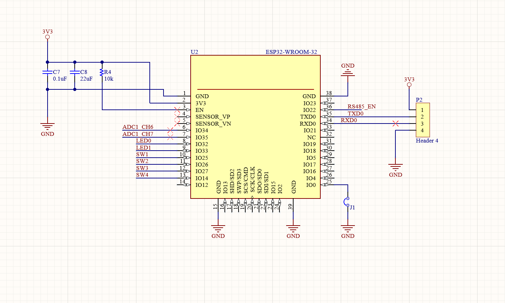
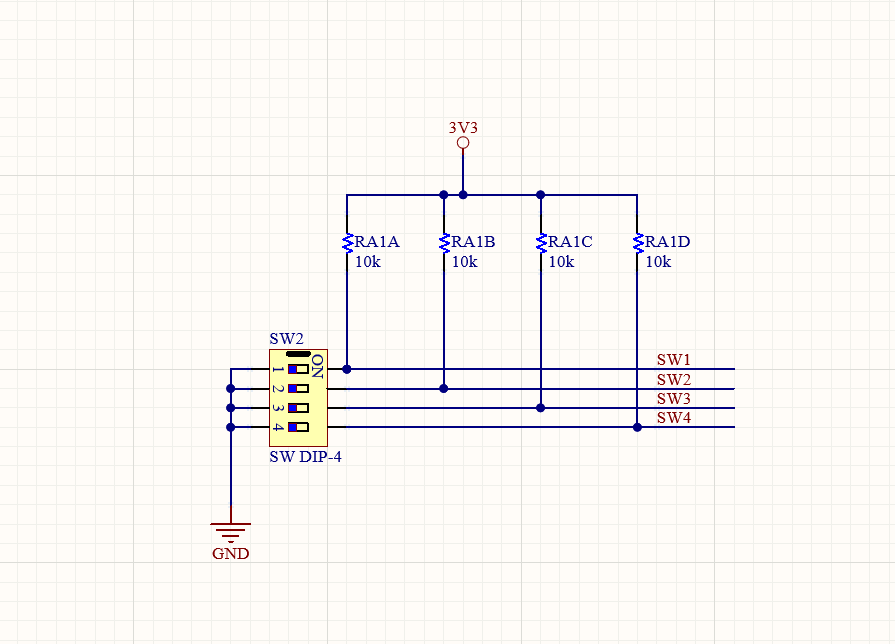
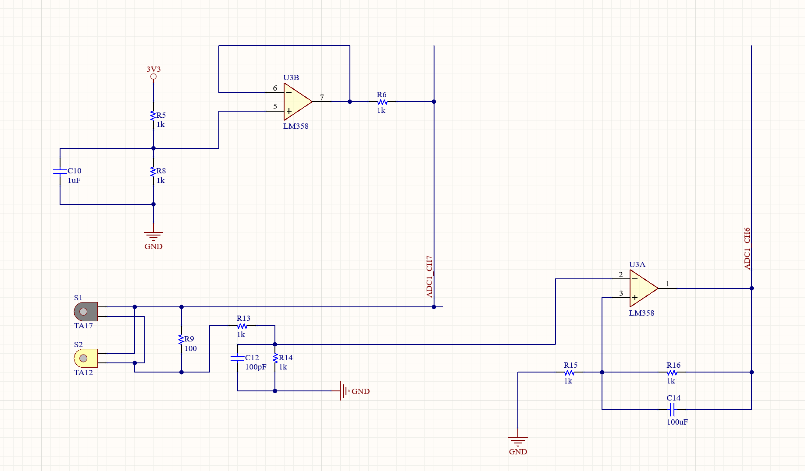
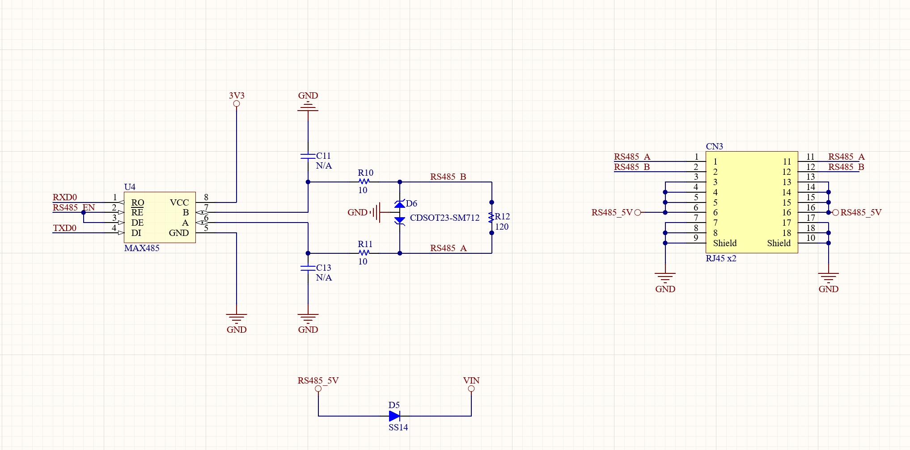
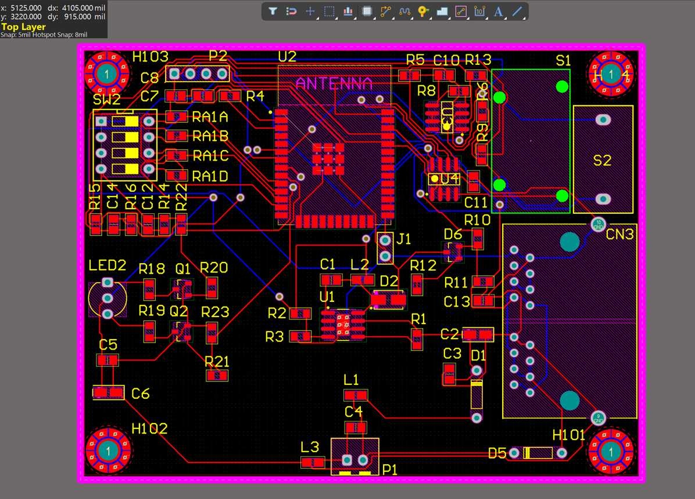
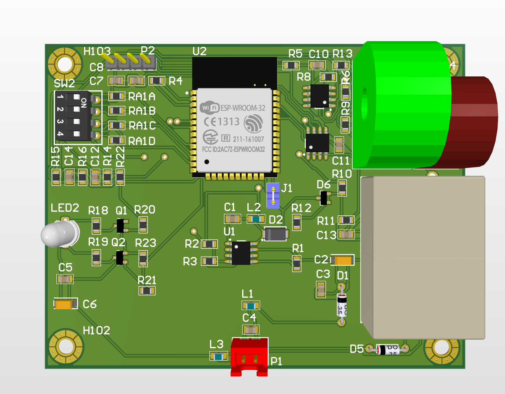
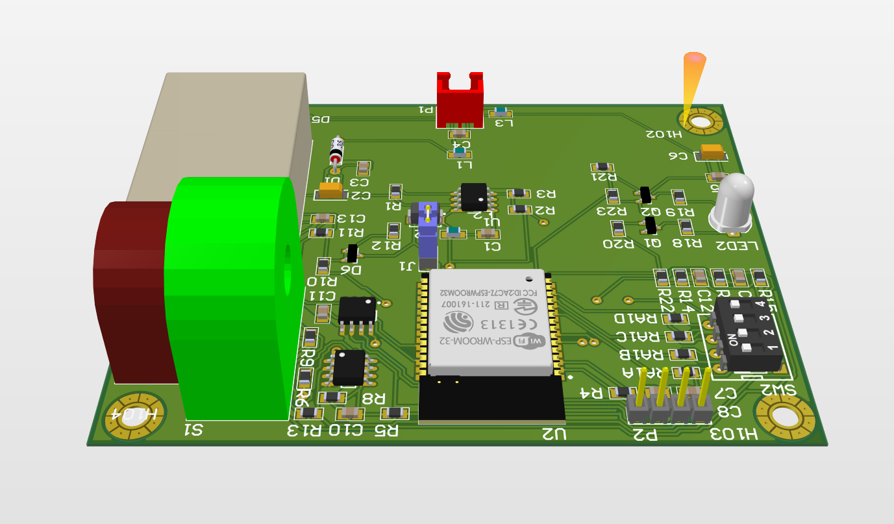
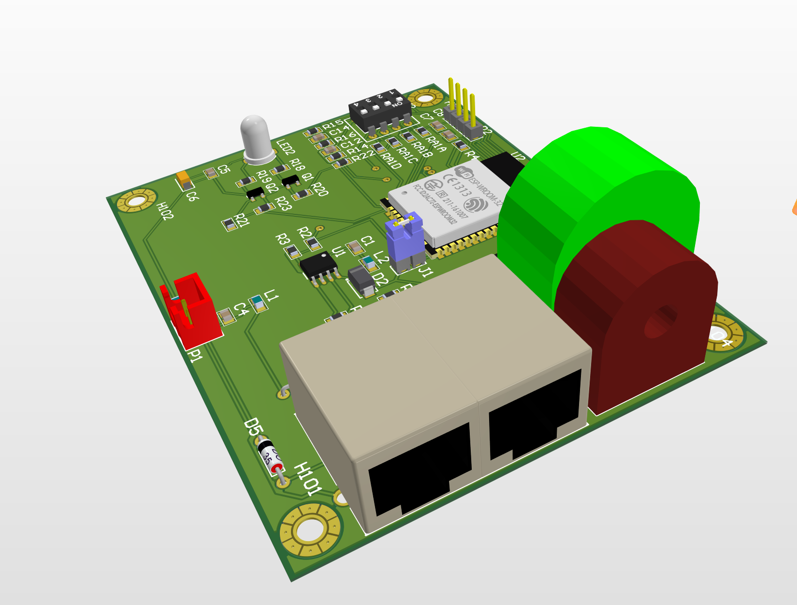
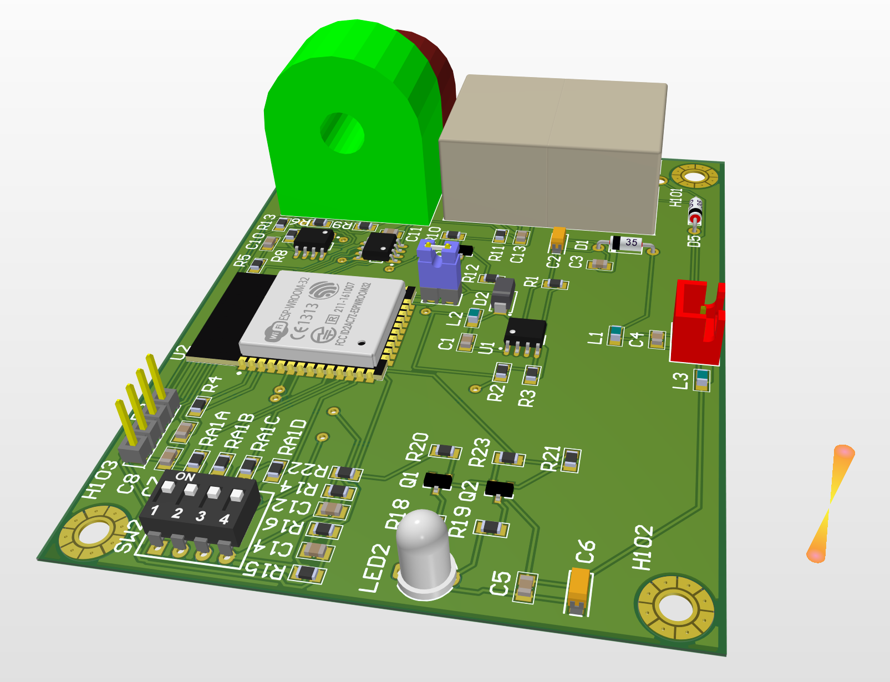

# BTL_ESP32-20251203T134206Z-1-001 CO2104

Repository này chứa dự án Altium của mạch điều khiển dựa trên **ESP32**, BTL môn Mạch điện - Điện tử TN CO2104

Bo mạch tích hợp:

- Nguồn **3.3 V** dạng switching regulator.
- Mạch **cảm biến dòng** (TA12/TA17) và khối xử lý tín hiệu cho ADC.
- Giao tiếp **RS485**.
- **LED báo trạng thái** và **DIP switch** cấu hình địa chỉ.
- ESP32 module làm bộ xử lý trung tâm.

> Tất cả ảnh dùng trong README được lưu trong thư mục `Image/`.

---

## 1. Tổng quan thiết kế

Chức năng chính:

- Chuyển đổi nguồn DC ngoài sang **3.3 V ổn định** cho ESP32 và mạch logic.
- Đo dòng AC thông qua cảm biến TA12/TA17, khuếch đại và lọc nhiễu trước khi đưa vào ADC của ESP32.
- Kết nối **RS485** để giao tiếp với các node khác hoặc hệ thống SCADA.
- LED báo trạng thái, DIP switch để chọn địa chỉ / chế độ hoạt động.

Ý tưởng bố trí:

- Tách khu vực **nguồn switching** và **cảm biến dòng** khỏi vùng ESP32 và RS485 để giảm nhiễu.
- Dùng **ground plane** và đường hồi dòng ngắn cho các tín hiệu analog/ADC.
- Đưa các đầu nối (nguồn, TA12/TA17, RJ45, v.v.) ra mép board để dễ đấu dây và lắp hộp.

---

## 2. Sơ đồ nguyên lý (Schematics)

Thiết kế được chia thành nhiều sheet tương ứng các khối chức năng.

### 2.1. ESP32 Core



### 2.2. Switch



### 2.3. Cảm biến dòng




### 2.4. Nguồn 3.3V



Một số sheet phụ / wiring:



Các file như `Schematic.png`, `Schematic2.png`, `Schematic4.png`, `Schematic9.png` thể hiện chi tiết thêm các nhánh mạch và test setup.

---

## 3. PCB Layout

### 3.1. Top layer


### 3.2. Bottom layer


Chiến lược đi dây:

- **Top layer**: ưu tiên cho tín hiệu quanh ESP32, RS485, LED, DIP, và một phần đường nguồn.
- **Bottom layer**: hỗ trợ các đường bị kẹt, đồng thời làm **plane GND** để giảm trở kháng đường hồi dòng.

Các thông số về chiều rộng line, khoảng cách, via được chọn theo rule của môn học và khả năng gia công PCB 2 lớp thông dụng.

---

## 4. Hình 3D

Các hình 3D được xuất trực tiếp từ Altium.

### 4.1. Nhìn từ trên xuống



### 4.2. Các góc nhìn bên cạnh

  
  


Hình 3D dùng để:

- Kiểm tra chiều cao linh kiện, hướng đầu nối, khoảng hở cơ khí.
- Xem vị trí cảm biến dòng, terminal block, module ESP32.
- Chuẩn bị cho việc thiết kế vỏ / gá lắp nếu cần.

---

## 5. Cấu trúc thư mục

```text
.
├─ Altium/                 # File .PrjPcb, .SchDoc, .PcbDoc, thư viện
├─ PSpice/                 # File mô phỏng (nếu có)
├─ Image/                  # Screenshot và hình 3D dùng trong README
│   ├─ Schematic.png
│   ├─ Schematic2.png
│   ├─ Schematic3.png
│   ├─ Schematic4.png
│   ├─ Schematic5.png
│   ├─ Schematic6.png
│   ├─ Schematic7.png
│   ├─ Schematic8.png
│   ├─ Schematic9.png
│   ├─ Wire.png
│   ├─ PCB_1.png
│   ├─ PCB_2_Sideview.png
│   ├─ PCB_3_Sideview.png
│   ├─ PCB_4_Sideview.png
│   ├─ PCB Top Layer.png
│   └─ PCB Bottom Layer.png
└─ README.md

